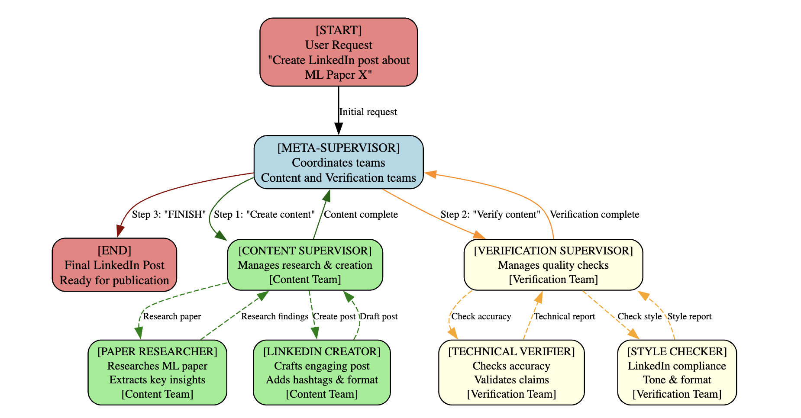

# PostAssist

AI-powered LinkedIn post generation for machine learning papers with multi-agent verification

## 🌐 **LIVE APPLICATION - DEPLOYED AND READY!** 🚀

**✅ Frontend**: https://post-assist-1lmcezvbs-ovo-okpubulukus-projects.vercel.app  
**✅ Backend**: https://postassist-production.up.railway.app  
**📊 API Docs**: https://postassist-production.up.railway.app/docs  

**📅 Status**: Successfully deployed July 2025  
**⚡ Framework**: Next.js 15.3.5 on Vercel + FastAPI on Railway  
**🔧 Features**: All pages live and functional - try it now!  

---

## 📋 Documentation Navigation

### 🏠 Main Documentation
- **📖 [README.md](./README.md)** - Project overview and getting started
- **🔀 [MERGE.md](./MERGE.md)** - Branch management and merge instructions

### 🛠️ Technical Guides
- **🤖 [Agentic AI Guide](./docs/AGENTIC_AI_GUIDE.md)** - Multi-agent system architecture and implementation
- **⚙️ [Backend Technical Guide](./docs/BACKEND_TECHNICAL_GUIDE.md)** - FastAPI backend deep dive
- **🎨 [Frontend Technical Guide](./docs/FRONTEND_TECHNICAL_GUIDE.md)** - Next.js frontend architecture

### 📊 Configuration & Setup
- **💼 [Business Case](./docs/BUSINESS_CASE.md)** - Project rationale and market analysis
- **🚀 [Railway Deployment Guide](./deploy/README.md)** - Complete Railway deployment with Redis setup
- **⚡ [Cache Configuration](./docs/CACHE_CONFIGURATION.md)** - Redis caching setup and optimization
- **⏱️ [Timeout Fixes](./docs/TIMEOUT_FIXES.md)** - Performance optimization and timeout handling

### 🔧 Component Documentation
- **🔌 [API Documentation](./api/README.md)** - Backend API reference
- **💻 [Frontend Documentation](./frontend/README.md)** - Frontend component guide
- **🌐 [Vercel Deployment Guide](./docs/VERCEL_DEPLOYMENT_GUIDE.md)** - Frontend deployment to Vercel ✅ **COMPLETED**

---

📊 **[View Full Business Case](./BUSINESS_CASE.md)**

## A Complete Multi-Agent LinkedIn Post Generation Platform

**PostAssist** is a full-stack AI-powered platform that generates engaging LinkedIn posts about machine learning research papers. It features a **Next.js frontend** with multiple specialized pages and a **FastAPI backend** using a sophisticated multi-agent system powered by **LangGraph** to research, create, and verify high-quality content.

---



---

## 🎨 Frontend Features

### 📄 Complete Page Suite
- **📝 Generate Page**: Interactive form for single post generation with real-time progress tracking and agent feedback
- **⚡ Batch Page**: Bulk generation of multiple posts with individual configuration, progress monitoring, and CSV export
- **📊 Status Page**: Comprehensive dashboard for monitoring all tasks with statistics, search, filtering, and task history
- **🔍 Verify Page**: Standalone post verification tool with technical accuracy and style compliance checking

### 🛠 Advanced Functionality
- **🔄 Real-time Updates**: Live progress tracking with agent team feedback during generation
- **📈 Task Management**: Complete task lifecycle management with status tracking and history
- **💾 Data Export**: CSV export for batch results and verification reports
- **🌓 Theme Support**: Complete light/dark mode compatibility across all pages
- **📱 Responsive Design**: Mobile-friendly interface with modern UI components
- **🎯 Error Handling**: Comprehensive error handling with user-friendly messages and retry logic

## 🚀 Quick Start

### Option 1: Full Stack (Frontend + Backend)

```bash
# Clone and setup
git clone <repository-url>
cd PostAssist

# Backend setup
cd api
cp .env.example .env
# Edit .env with your API keys (OPENAI_API_KEY, TAVILY_API_KEY)
python main.py

# Frontend setup (new terminal)
cd frontend
npm install
npm run dev

# Access the application
# Frontend: http://localhost:3000
# Backend API: http://localhost:8000
# API Documentation: http://localhost:8000/docs
```

### Option 2: Docker (Recommended)

```bash
# Start both frontend and backend with Docker Compose
docker-compose up

# Access the application
# Frontend: http://localhost:3000
# Backend API: http://localhost:8000
# API Documentation: http://localhost:8000/docs
```

## 📱 Application Pages

### 🏠 Generate Page (`/`)
**Single Post Generation** - The main interface for creating individual LinkedIn posts
- **Interactive Form**: Paper title, context, audience, and tone selection
- **Real-time Progress**: Live agent feedback during generation process
- **Instant Results**: Generated post with engagement metrics and copy functionality
- **LinkedIn Integration**: Direct share to LinkedIn with optimized formatting

### ⚡ Batch Page (`/batch`) 
**Bulk Post Generation** - Create multiple posts simultaneously
- **Multi-item Management**: Add/remove posts with individual configurations
- **Progress Monitoring**: Real-time progress tracking for all posts
- **Results Dashboard**: Comprehensive results with copy and CSV export
- **Error Handling**: Individual post error handling with retry options

### 📊 Status Page (`/status`)
**Task Monitoring Dashboard** - Monitor all generation tasks
- **Statistics Overview**: Total tasks, completion rates, and performance metrics
- **Task History**: Complete task log with search and filtering capabilities
- **Real-time Updates**: Auto-refresh with live status updates
- **Task Details**: Detailed view of each task with full metadata

### 🔍 Verify Page (`/verify`)
**Post Verification Tool** - Standalone verification for existing posts
- **Verification Types**: Technical accuracy, style compliance, or comprehensive review
- **Detailed Analysis**: Scoring breakdown with specific recommendations
- **Character/Word Count**: Real-time content metrics
- **Report Export**: Download verification reports for record-keeping

### Option 3: Backend Only (API Mode)

```bash
# Make start script executable and run
chmod +x start.sh
./start.sh

# Or manual setup
python scripts/dev.py setup
python scripts/dev.py run
```

## 📖 Application Access

Once running, visit:
- **Frontend Application**: http://localhost:3000 (Main user interface)
- **Interactive API Docs**: http://localhost:8000/docs (Backend API documentation)
- **Alternative API Docs**: http://localhost:8000/redoc
- **Health Check**: http://localhost:8000/health

## 🏗 Project Structure

```
PostAssist/
├── frontend/                     # Next.js Frontend Application
│   ├── src/
│   │   ├── app/                  # App Router pages
│   │   │   ├── page.tsx          # Generate page (main interface)
│   │   │   ├── batch/page.tsx    # Batch generation page
│   │   │   ├── status/page.tsx   # Task monitoring dashboard
│   │   │   └── verify/page.tsx   # Post verification page
│   │   ├── components/           # Reusable UI components
│   │   │   ├── layout/           # Layout components
│   │   │   └── ui/               # Base UI components
│   │   ├── lib/                  # Utilities and API client
│   │   └── types/                # TypeScript type definitions
│   ├── package.json              # Frontend dependencies
│   └── tailwind.config.ts        # Tailwind CSS configuration
├── api/                          # FastAPI Backend Application
│   ├── main.py                   # FastAPI app with all endpoints
│   ├── config.py                 # Configuration and settings
│   ├── models/                   # Pydantic models
│   │   ├── requests.py           # Request models
│   │   ├── responses.py          # Response models
│   │   └── state.py              # LangGraph state models
│   ├── tools/                    # LangChain tools
│   │   ├── linkedin_tools.py     # LinkedIn-specific tools
│   │   └── search_tools.py       # Research and search tools
│   └── agents/                   # Multi-agent system
│       ├── helpers.py            # Agent utilities
│       ├── content_team.py       # Content creation team
│       ├── verification_team.py  # Verification team
│       └── meta_supervisor.py    # Meta-supervisor
├── examples/                     # Usage examples
│   └── example_client.py         # Complete API client example
├── scripts/                      # Utility scripts
│   ├── dev.py                    # Development utilities
│   ├── test_api.py               # API testing suite
│   └── utils.py                  # General utilities
├── Multi_Agent_RAG_LangGraph.ipynb  # Original notebook
├── requirements.txt              # Python dependencies
├── Dockerfile                    # Docker configuration
├── docker-compose.yml           # Docker Compose setup
└── start.sh                     # Quick start script
```

## 🎯 API Endpoints

### Core Endpoints

| Method | Endpoint | Description |
|--------|----------|-------------|
| `POST` | `/generate-post` | Generate LinkedIn post about ML paper |
| `GET` | `/status/{task_id}` | Check individual task status and results |
| `GET` | `/tasks` | Get all tasks with their current status |
| `POST` | `/verify-post` | Verify post technical accuracy & style |
| `POST` | `/batch-generate` | Generate multiple posts in batch |
| `GET` | `/health` | Health check and service status |

### Example Usage

```python
import requests

# Generate a LinkedIn post
response = requests.post("http://localhost:8000/generate-post", json={
    "paper_title": "Attention Is All You Need",
    "additional_context": "Focus on practical NLP applications",
    "target_audience": "professional",
    "tone": "professional"
})

task_id = response.json()["task_id"]

# Check status
status = requests.get(f"http://localhost:8000/status/{task_id}")
print(status.json())
```

## 🧠 Multi-Agent Architecture

The system uses a hierarchical multi-agent structure:

```
🎯 Meta-Supervisor 
    ↓
👥 Content Creation Team
    ├── 🔬 Paper Researcher (Tavily search, ArXiv research)
    └── ✍️  LinkedIn Creator (Post generation, hashtag optimization)
    ↓
🎯 Meta-Supervisor 
    ↓
✅ Verification Team  
    ├── 🔍 Technical Verifier (Accuracy checking)
    └── 📱 Style Checker (LinkedIn compliance)
    ↓
🏁 Final LinkedIn Post
```

### Key Features

- **Autonomous Operation**: Each agent works independently within its specialty
- **Quality Assurance**: Two-stage verification for technical accuracy and style
- **Scalable Design**: Easy to add new agents or modify existing workflows
- **Robust Error Handling**: Comprehensive error handling and recovery
- **Async Processing**: Background task processing with real-time status updates

## 🛠 Development

### Development Commands

```bash
# Setup development environment
python scripts/dev.py setup

# Run development server (with hot reload)
python scripts/dev.py run

# Run test suite
python scripts/dev.py test

# Format code
python scripts/dev.py format

# Lint code
python scripts/dev.py lint

# Type checking
python scripts/dev.py typecheck

# Run all checks + start server
python scripts/dev.py all
```

### Testing

```bash
# Run comprehensive API tests
python scripts/test_api.py

# Test specific endpoint
python scripts/test_api.py --url http://localhost:8000

# Save test results
python scripts/test_api.py --output test_results.json
```

### Utilities

```bash
# Generate sample requests
python scripts/utils.py samples

# Create cURL examples
python scripts/utils.py curl

# Check API health
python scripts/utils.py health

# Create deployment checklist
python scripts/utils.py checklist
```

## 🧪 Test Examples

Here are 5 short ML papers from arXiv perfect for testing PostAssist:

### 1. **Scaling Synthetic Data Creation with 1,000,000,000 Personas**
- **arXiv ID**: `2406.20094`
- **Topic**: LLM-based synthetic data generation
- **Why test-worthy**: Hot topic, practical applications, easy to understand

### 2. **On Large Language Models in National Security Applications** 
- **arXiv ID**: `2407.03453`
- **Topic**: LLMs in security contexts
- **Why test-worthy**: 20 pages, policy implications, broad audience appeal

### 3. **MLD-EA: Check and Complete Narrative Coherence by Introducing Emotions and Actions**
- **arXiv ID**: `2412.02897`
- **Topic**: Narrative understanding with LLMs
- **Why test-worthy**: Recent (Dec 2024), emotion + AI angle, story generation

### 4. **Apple Vision Pro: Comments in Healthcare**
- **arXiv ID**: `2401.08685`
- **Topic**: AR/VR in medical applications
- **Why test-worthy**: Short, practical applications, trending technology

### 5. **Why is it so hard to find a job now? Enter Ghost Jobs**
- **arXiv ID**: `2410.21771`
- **Topic**: LLM-BERT analysis of employment market
- **Why test-worthy**: Relatable topic, economic impact, uses ML techniques

💡 **Pro tip**: Try different target audiences (Academic vs Professional vs General) and tones (Professional vs Conversational vs Technical) to see how PostAssist adapts the content!

## 🔧 Configuration

### Required Environment Variables

```bash
# Required API Keys
OPENAI_API_KEY=your_openai_api_key_here
TAVILY_API_KEY=your_tavily_api_key_here

# Optional Configuration
DEBUG=false
HOST=0.0.0.0
PORT=8000
REDIS_URL=redis://localhost:6379
```

### Application Settings

The application can be configured via `app/config.py`:
- OpenAI model selection and parameters
- Rate limiting settings
- File storage configuration  
- Logging levels
- LangGraph recursion limits

## 🚀 Deployment

### Docker Deployment

```bash
# Build and run with Docker Compose
docker-compose up --build

# Run in background
docker-compose up -d

# View logs
docker-compose logs -f
```

### Manual Deployment

```bash
# Install dependencies
pip install -r requirements.txt

# Set production environment
export DEBUG=false

# Run with production server
uvicorn app.main:app --host 0.0.0.0 --port 8000
```

### Production Checklist

Run the deployment checklist generator:

```bash
python scripts/utils.py checklist
```

This creates a comprehensive `DEPLOYMENT_CHECKLIST.md` with all necessary deployment steps.

## 📊 Example Output

**Generated LinkedIn Post:**
```
🚀 **Transforming the Future of AI: Attention Is All You Need**

The groundbreaking paper that introduced the Transformer architecture has 
fundamentally changed how we approach natural language processing.

💡 **Key Takeaways:**

1. Self-attention mechanisms enable parallel processing
2. Eliminates the need for recurrent layers
3. Achieved state-of-the-art results with simpler architecture
4. Became the foundation for BERT, GPT, and T5

What are your thoughts on this research? How do you see it impacting your industry?

#MachineLearning #AI #Research #Innovation #TechTrends #Transformers #NLP
```

## 🔗 Related Files

- **Original Notebook**: `Multi_Agent_RAG_LangGraph.ipynb` - Contains the original implementation and detailed explanations
- **API Documentation**: `app/README.md` - Detailed API documentation
- **Examples**: `examples/` - Complete usage examples and sample code
- **Docker Config**: `Dockerfile` & `docker-compose.yml` - Containerization setup

## 🤝 Contributing

1. Fork the repository
2. Create a feature branch (`git checkout -b feature/amazing-feature`)
3. Make your changes
4. Run tests (`python scripts/test_api.py`)
5. Commit your changes (`git commit -m 'Add amazing feature'`)
6. Push to the branch (`git push origin feature/amazing-feature`)
7. Open a Pull Request

## 📄 License

This project is licensed under the MIT License - see the LICENSE file for details.

## 🆘 Support

For issues and questions:

1. Check the [API documentation](http://localhost:8000/docs) 
2. Review the [deployment checklist](DEPLOYMENT_CHECKLIST.md)
3. Run the health check: `python scripts/utils.py health`
4. Check the logs for error details
5. Ensure API keys are properly configured

## 🎉 Acknowledgments

- Built with [FastAPI](https://fastapi.tiangolo.com/) for high-performance async API
- Powered by [LangGraph](https://langchain-ai.github.io/langgraph/) for multi-agent orchestration
- Uses [OpenAI GPT](https://openai.com/) models for intelligent content generation
- Integrates [Tavily](https://tavily.com/) for comprehensive web search