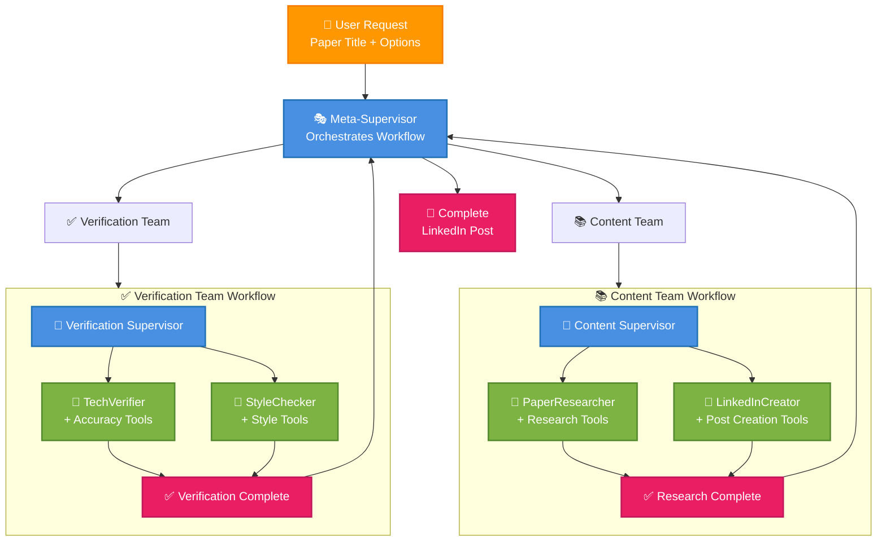
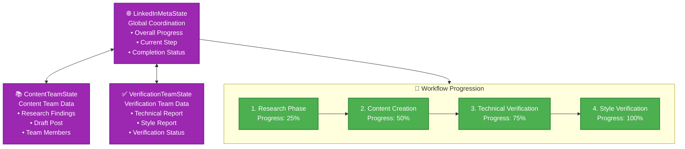
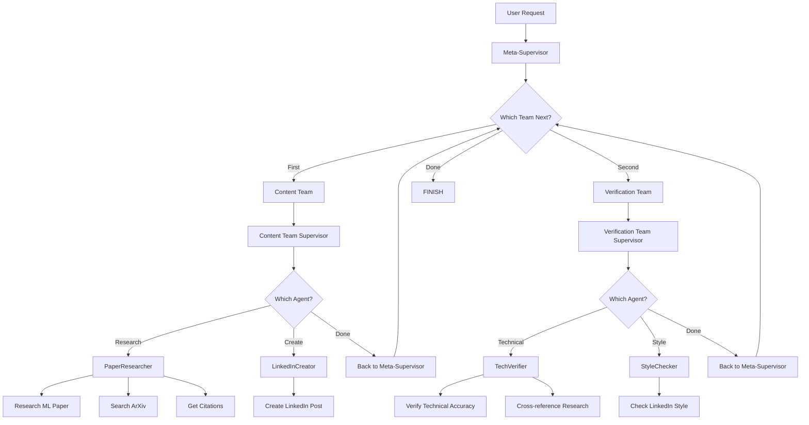

# 🤖 Agentic AI Guide: Multi-Agent System in PostAssist

Welcome to the comprehensive guide on **Agentic AI** and how it's masterfully implemented in PostAssist! This guide will take you from zero to hero in understanding one of the most sophisticated AI architectures you can build today.

## 📋 Documentation Navigation

### 🏠 Main Documentation
- **📖 [README.md](../README.md)** - Project overview and getting started
- **🔀 [MERGE.md](../MERGE.md)** - Branch management and merge instructions

### 🛠️ Technical Guides
- **🤖 [Agentic AI Guide](./AGENTIC_AI_GUIDE.md)** - Multi-agent system architecture and implementation
- **⚙️ [Backend Technical Guide](./BACKEND_TECHNICAL_GUIDE.md)** - FastAPI backend deep dive
- **🎨 [Frontend Technical Guide](./FRONTEND_TECHNICAL_GUIDE.md)** - Next.js frontend architecture

### 📊 Configuration & Setup
- **💼 [Business Case](./BUSINESS_CASE.md)** - Project rationale and market analysis
- **⚡ [Cache Configuration](./CACHE_CONFIGURATION.md)** - Redis caching setup and optimization
- **⏱️ [Timeout Fixes](./TIMEOUT_FIXES.md)** - Performance optimization and timeout handling

### 🔧 Component Documentation
- **🔌 [API Documentation](../api/README.md)** - Backend API reference
- **💻 [Frontend Documentation](../frontend/README.md)** - Frontend component guide

---

## 📚 Table of Contents

1. [What is Agentic AI?](#what-is-agentic-ai)
2. [Why Use Agentic AI?](#why-use-agentic-ai)
3. [PostAssist's Multi-Agent Architecture](#postassists-multi-agent-architecture)
4. [Agent Roles and Responsibilities](#agent-roles-and-responsibilities)
5. [Tool Ecosystem](#tool-ecosystem)
6. [State Management](#state-management)
7. [Workflow Coordination](#workflow-coordination)
8. [Implementation Deep Dive](#implementation-deep-dive)
9. [Request Flow Analysis](#request-flow-analysis)
10. [Advanced Patterns](#advanced-patterns)

---

## 🎯 What is Agentic AI?

**Agentic AI** represents a paradigm shift from monolithic AI systems to **autonomous, collaborative AI agents** that work together to solve complex problems. Think of it like this:

### Traditional AI vs Agentic AI

**Traditional AI (Single Model):**
```
User Input → One Big AI Model → Output
```
- Like having one super-smart person do EVERYTHING
- Limited by single model's capabilities
- Hard to debug and improve specific parts
- No specialization

**Agentic AI (Multi-Agent System):**
```
User Input → Team of Specialized AI Agents → Coordinated Output
```
- Like having a **team of experts** working together
- Each agent specializes in specific tasks
- Better error handling and debugging
- More robust and scalable

### Core Principles of Agentic AI

1. **🎯 Specialization**: Each agent has a specific role and expertise
2. **🤝 Collaboration**: Agents communicate and coordinate with each other
3. **🔧 Tool Use**: Agents can use external tools to accomplish tasks
4. **🧠 Autonomy**: Agents make decisions independently within their domain
5. **📊 State Management**: Shared understanding of progress and data
6. **🔄 Iterative Improvement**: Agents can review and refine each other's work

---

## 🚀 Why Use Agentic AI?

### Advantages Over Single-Model Systems

| **Aspect** | **Single Model** | **Multi-Agent System** |
|------------|------------------|------------------------|
| **Specialization** | Jack of all trades, master of none | Each agent is a domain expert |
| **Scalability** | Hard to scale specific capabilities | Scale individual agents independently |
| **Debugging** | Black box - hard to debug | Clear agent responsibilities |
| **Quality Control** | Limited self-review | Dedicated verification agents |
| **Flexibility** | Monolithic changes required | Swap/upgrade individual agents |
| **Reliability** | Single point of failure | Distributed resilience |

### Real-World Analogy

Think of building a house:

**Single Model Approach**: One person (architect, engineer, electrician, plumber, painter)
- Overwhelmed and error-prone
- Can't focus on excellence in any area
- Hard to verify work quality

**Agentic Approach**: Specialized team with project manager
- **Architect** designs the structure
- **Engineer** ensures structural integrity  
- **Electrician** handles electrical systems
- **Plumber** manages water systems
- **Project Manager** coordinates everything

Each expert focuses on their specialty, and a coordinator ensures everything works together perfectly!

---

## 🏗️ PostAssist's Multi-Agent Architecture

PostAssist implements a **hierarchical multi-agent system** with three levels of coordination:

### 🎭 The Three-Tier Architecture

```
Level 1: Meta-Supervisor (Orchestrator)
├── Level 2: Content Team (Research + Creation)
│   ├── PaperResearcher Agent
│   ├── LinkedInCreator Agent
│   └── Content Team Supervisor
└── Level 2: Verification Team (Quality Control)
    ├── TechVerifier Agent
    ├── StyleChecker Agent
    └── Verification Team Supervisor
```

### 🎨 System Architecture Overview

The following diagram shows the high-level agentic AI architecture and workflow:



### 🔧 Agent Tool Mapping

Each agent has access to specialized tools for their role:

#### 🔬 PaperResearcher Tools
- `research_ml_paper` - Deep paper analysis
- `tavily_tool` - Web search capabilities  
- `search_arxiv_papers` - Academic database access
- `get_paper_citations` - Citation and impact analysis
- `search_recent_developments` - Latest trend tracking
- `search_paper_applications` - Real-world use cases

#### 📱 LinkedInCreator Tools
- `create_linkedin_post` - Professional post generation

#### 🔬 TechVerifier Tools  
- `verify_technical_accuracy` - Fact validation
- `research_ml_paper` - Cross-reference verification

#### 🎨 StyleChecker Tools
- `check_linkedin_style` - LinkedIn compliance checking

### 📊 State Management Flow

The multi-level state management ensures perfect coordination:



### 🎼 The Symphony of AI Agents

PostAssist's agents work like a **professional content creation agency**:

1. **📋 Meta-Supervisor** (Project Manager)
   - Coordinates the entire workflow
   - Decides which team works when
   - Ensures quality standards are met

2. **📖 Content Team** (Creative Department)
   - **PaperResearcher**: The academic expert who dives deep into research
   - **LinkedInCreator**: The social media specialist who crafts engaging posts
   - **Content Supervisor**: Manages the creative process

3. **✅ Verification Team** (Quality Assurance)
   - **TechVerifier**: The fact-checker ensuring technical accuracy
   - **StyleChecker**: The editor ensuring LinkedIn best practices
   - **Verification Supervisor**: Manages the QA process

---

## 👥 Agent Roles and Responsibilities

Let's meet each agent and understand their unique superpowers!

### 🎯 Meta-Supervisor Agent

**Role**: The Orchestra Conductor
**Personality**: Strategic, decisive, quality-focused

```python
# Meta-Supervisor's Mission
"You are a meta-supervisor managing LinkedIn post generation. You coordinate between 
the following teams: {team_members}. First direct the Content team to research a paper 
and create a LinkedIn post. Then send the completed post to the Verification team to check 
technical accuracy and LinkedIn style compliance. 
The workflow should be: Content team → Verification team → FINISH."
```

**Key Responsibilities**:
- 🎯 **Workflow Orchestration**: Decides which team should act next
- 🔄 **Quality Gates**: Ensures each phase completes before moving to next
- 📊 **Progress Tracking**: Monitors overall system state
- 🛡️ **Error Handling**: Manages failures and retries

---

### 📚 Content Team Agents

#### 🔬 PaperResearcher Agent

**Role**: The Academic Detective
**Personality**: Thorough, analytical, accuracy-obsessed

```python
# PaperResearcher's Mission
"You are an expert AI researcher who specializes in understanding and summarizing 
machine learning papers. Your job is to research papers thoroughly and extract 
key insights, methodologies, and results. Focus on accuracy and clarity."
```

**Superpowers**:
- 🔍 **Deep Research**: Uses advanced search tools to find comprehensive information
- 📊 **Data Synthesis**: Combines multiple sources into coherent insights
- 🎯 **Focus Areas**: Can target specific aspects (methodology, results, applications)

**Tools at Disposal**:
- `research_ml_paper`: Main research powerhouse
- `tavily_tool`: Web search capabilities

#### 📱 LinkedInCreator Agent

**Role**: The Social Media Virtuoso
**Personality**: Creative, engaging, audience-aware

```python
# LinkedInCreator's Mission
"You are a social media expert who specializes in creating engaging LinkedIn posts 
about technical topics. You know how to make complex AI research accessible and 
engaging for a professional audience."
```

**Superpowers**:
- ✨ **Content Transformation**: Converts research into engaging posts
- 🎨 **Audience Adaptation**: Tailors content for different professional audiences
- 📈 **Engagement Optimization**: Adds hashtags, questions, and engagement elements

**Tools at Disposal**:
- `create_linkedin_post`: Professional post creation engine

---

### ✅ Verification Team Agents

#### 🔬 TechVerifier Agent

**Role**: The Technical Fact-Checker
**Personality**: Skeptical, precise, research-oriented

```python
# TechVerifier's Mission
"You are a technical reviewer and fact-checker specializing in machine learning research. 
Your job is to verify that LinkedIn posts accurately represent the research they discuss. 
Check for technical accuracy, proper methodology description, and correct representation 
of results."
```

**Superpowers**:
- 🧪 **Accuracy Analysis**: Verifies technical claims against research
- 🚫 **Overstatement Detection**: Flags exaggerated or incorrect claims
- 📝 **Attribution Checking**: Ensures proper author recognition

**Tools at Disposal**:
- `verify_technical_accuracy`: Technical validation engine
- `research_ml_paper`: Cross-reference verification

#### 🎨 StyleChecker Agent

**Role**: The LinkedIn Style Guru
**Personality**: Aesthetic, professional, engagement-focused

```python
# StyleChecker's Mission
"You are a LinkedIn content strategist who ensures posts follow best practices for 
professional social media. Check for appropriate tone, formatting, hashtag usage, 
engagement elements, and overall LinkedIn style compliance."
```

**Superpowers**:
- 📏 **Format Optimization**: Ensures perfect LinkedIn formatting
- #️⃣ **Hashtag Strategy**: Validates optimal hashtag usage
- 💬 **Engagement Mechanics**: Checks for questions and interaction drivers

**Tools at Disposal**:
- `check_linkedin_style`: LinkedIn optimization engine

---

## 🔧 Tool Ecosystem

The agents don't work in isolation - they have access to a sophisticated **tool ecosystem** that gives them real-world capabilities!

### 🔍 Search Tools Arsenal

| **Tool** | **Purpose** | **Used By** | **Superpower** |
|----------|-------------|-------------|----------------|
| `research_ml_paper` | Deep paper research | PaperResearcher, TechVerifier | 🎯 Comprehensive academic analysis |
| `tavily_tool` | Web search | PaperResearcher | 🌐 Real-time information gathering |
| `search_arxiv_papers` | ArXiv-specific search | PaperResearcher | 📚 Academic paper database access |
| `get_paper_citations` | Impact analysis | PaperResearcher | 📊 Citation and impact metrics |
| `search_recent_developments` | Trend analysis | PaperResearcher | 🚀 Latest developments tracking |
| `search_paper_applications` | Use case discovery | PaperResearcher | 💼 Real-world application analysis |

### 📝 LinkedIn Tools Arsenal

| **Tool** | **Purpose** | **Used By** | **Superpower** |
|----------|-------------|-------------|----------------|
| `create_linkedin_post` | Post generation | LinkedInCreator | ✨ Professional content creation |
| `verify_technical_accuracy` | Fact checking | TechVerifier | 🔬 Technical validation |
| `check_linkedin_style` | Style compliance | StyleChecker | 🎨 LinkedIn optimization |

### 🛠️ How Agents Use Tools

The beauty of this system is that **agents autonomously decide when and how to use tools**:

```python
# Example: PaperResearcher deciding to use multiple tools
def research_process(paper_title):
    # 1. Start with comprehensive research
    basic_info = research_ml_paper(paper_title, search_depth="detailed")
    
    # 2. Get additional context
    arxiv_results = search_arxiv_papers(paper_title)
    
    # 3. Find real-world applications
    applications = search_paper_applications(paper_title)
    
    # 4. Check recent developments
    recent_work = search_recent_developments(extracted_topic)
    
    # 5. Synthesize all information
    return comprehensive_analysis
```

---

## 📊 State Management

One of the most sophisticated aspects of PostAssist's agentic system is its **hierarchical state management**. Think of it as a **shared memory system** that allows agents to coordinate perfectly.

### 🏗️ State Architecture

```
┌─────────────────────────────────┐
│     LinkedInMetaState           │  ← Global coordination
│  (Meta-Supervisor Level)        │
├─────────────────────────────────┤
│     ContentTeamState            │  ← Content team coordination
│  (Content Team Level)           │
├─────────────────────────────────┤
│   VerificationTeamState         │  ← Verification team coordination
│  (Verification Team Level)      │
└─────────────────────────────────┘
```

### 🎯 LinkedInMetaState (Global State)

The **master control state** that tracks the entire workflow:

```python
class LinkedInMetaState(TypedDict):
    messages: List[BaseMessage]           # Communication history
    next: str                            # Which team acts next
    task_id: Optional[str]               # Unique task identifier
    paper_title: Optional[str]           # Paper being processed
    current_step: Optional[str]          # Current workflow step
    progress: float                      # Overall completion %
    research_complete: bool              # Research phase done?
    content_complete: bool               # Content creation done?
    verification_complete: bool          # Verification done?
    final_post: Optional[str]           # Final LinkedIn post
    error_message: Optional[str]         # Error tracking
```

**Real-World Analogy**: Like a **project dashboard** that shows overall progress, current phase, and completion status.

### 📖 ContentTeamState (Team State)

Tracks the content creation process:

```python
class ContentTeamState(TypedDict):
    messages: List[BaseMessage]          # Team communication
    team_members: str                   # "PaperResearcher, LinkedInCreator"
    next: str                          # Which agent acts next
    paper_title: Optional[str]         # Paper being researched
    research_findings: Optional[str]    # Research results
    draft_post: Optional[str]          # Initial post draft
```

### ✅ VerificationTeamState (QA State)

Tracks the verification process:

```python
class VerificationTeamState(TypedDict):
    messages: List[BaseMessage]          # Team communication
    team_members: str                   # "TechVerifier, StyleChecker"
    next: str                          # Which agent acts next
    post_content: Optional[str]        # Post being verified
    technical_report: Optional[str]     # Technical accuracy report
    style_report: Optional[str]        # Style compliance report
    verification_complete: bool         # Verification done?
```

### 🔄 State Flow Example

```python
# Step 1: Initialize global state
meta_state = {
    "progress": 0.0,
    "current_step": "research",
    "research_complete": False,
    "content_complete": False,
    "verification_complete": False
}

# Step 2: Content team updates their state
content_state = {
    "research_findings": "Comprehensive paper analysis...",
    "draft_post": "🚀 Exciting breakthrough in AI..."
}

# Step 3: Global state reflects content completion
meta_state.update({
    "progress": 50.0,
    "current_step": "verification",
    "content_complete": True
})

# Step 4: Verification team adds their analysis
verification_state = {
    "technical_report": "Technical accuracy: 95%",
    "style_report": "LinkedIn compliance: 88%",
    "verification_complete": True
}

# Step 5: Final global state
meta_state.update({
    "progress": 100.0,
    "current_step": "complete",
    "verification_complete": True,
    "final_post": "Final polished LinkedIn post..."
})
```

---

## 🎼 Workflow Coordination

The magic of PostAssist lies in how agents **coordinate autonomously** to produce high-quality content. Let's break down this beautiful dance!

### 🎯 The Master Workflow



### 🚀 Workflow Deep Dive

#### Phase 1: Content Creation
```python
# Meta-Supervisor says: "Content team, create a post!"
content_workflow = {
    "step_1": "PaperResearcher researches paper thoroughly",
    "step_2": "LinkedInCreator creates engaging post",
    "step_3": "Content Supervisor reviews and approves",
    "result": "Draft LinkedIn post ready for verification"
}
```

#### Phase 2: Quality Verification
```python
# Meta-Supervisor says: "Verification team, check this post!"
verification_workflow = {
    "step_1": "TechVerifier validates technical accuracy",
    "step_2": "StyleChecker ensures LinkedIn compliance", 
    "step_3": "Verification Supervisor approves quality",
    "result": "Verified, publication-ready LinkedIn post"
}
```

### 🎭 Supervisor Decision Making

Each supervisor uses **intelligent routing** to decide which agent should act next:

```python
def supervisor_decision_logic(current_state):
    """How supervisors decide which agent acts next"""
    
    # Content Team Supervisor
    if not research_complete:
        return "PaperResearcher"  # Research first
    elif not content_created:
        return "LinkedInCreator"  # Then create content
    else:
        return "FINISH"           # Done with content phase
    
    # Verification Team Supervisor  
    if not technical_verified:
        return "TechVerifier"     # Verify accuracy first
    elif not style_verified:
        return "StyleChecker"     # Then check style
    else:
        return "FINISH"           # Done with verification
    
    # Meta-Supervisor
    if not content_complete:
        return "Content team"     # Content creation first
    elif not verification_complete:
        return "Verification team" # Then verification
    else:
        return "FINISH"           # All done!
```

---

## 💻 Implementation Deep Dive

Now let's peek under the hood and see how this agentic magic actually works in code!

### 🏗️ LangGraph + LangChain Architecture

PostAssist uses **LangGraph** for agent coordination and **LangChain** for tool integration:

```python
# The secret sauce: Creating an agent with tools
def create_agent(llm, tools, system_prompt):
    """Create a function-calling agent"""
    
    # 1. Enhanced prompt for autonomous operation
    enhanced_prompt = system_prompt + (
        "\nWork autonomously according to your specialty, using the tools available to you."
        " Do not ask for clarification."
        " Your other team members will collaborate with you with their own specialties."
        " You are chosen for a reason!"
    )
    
    # 2. Create prompt template with message placeholders
    prompt = ChatPromptTemplate.from_messages([
        ("system", enhanced_prompt),
        MessagesPlaceholder(variable_name="messages"),
        MessagesPlaceholder(variable_name="agent_scratchpad"),
    ])
    
    # 3. Create the agent with OpenAI function calling
    agent = create_openai_functions_agent(llm, tools, prompt)
    
    # 4. Wrap in executor for tool handling
    executor = AgentExecutor(agent=agent, tools=tools)
    
    return executor
```

### 🎯 Supervisor Creation Pattern

Supervisors use **structured decision making** with JSON output:

```python
def create_team_supervisor(llm, system_prompt, members):
    """Create an intelligent team supervisor"""
    
    options = ["FINISH"] + members  # Possible routing decisions
    
    # Enhanced prompt with clear instructions
    prompt = ChatPromptTemplate.from_messages([
        ("system", system_prompt + "\n\nYou must respond with a JSON object containing a 'next' field."),
        MessagesPlaceholder(variable_name="messages"),
        (
            "system",
            "Given the conversation above, who should act next?"
            " Or should we FINISH? Select one of: {options}\n"
            "Respond in this exact format: {{\"next\": \"OPTION_NAME\"}}",
        ),
    ]).partial(options=str(options), team_members=", ".join(members))
    
    # Smart parsing with fallbacks
    def parse_response(response):
        content = response.content.strip()
        try:
            import json
            parsed = json.loads(content)
            return {"next": parsed.get("next", "FINISH")}
        except:
            # Fallback: extract from text
            for option in options:
                if option.upper() in content.upper():
                    return {"next": option}
            return {"next": "FINISH"}
    
    return prompt | llm | parse_response
```

### 🔗 Graph Construction Magic

Each team is a **complete sub-graph** with its own workflow:

```python
def create_content_team_graph():
    """Build the content creation workflow graph"""
    
    # 1. Create specialized agents
    paper_researcher = create_agent(llm, [research_ml_paper, tavily_tool], researcher_prompt)
    linkedin_creator = create_agent(llm, [create_linkedin_post], creator_prompt)
    content_supervisor = create_team_supervisor(llm, supervisor_prompt, ["PaperResearcher", "LinkedInCreator"])
    
    # 2. Build the state graph
    content_graph = StateGraph(ContentTeamState)
    
    # 3. Add nodes (agents)
    content_graph.add_node("PaperResearcher", paper_researcher_node)
    content_graph.add_node("LinkedInCreator", linkedin_creator_node)
    content_graph.add_node("content_supervisor", content_supervisor)
    
    # 4. Define workflow edges
    content_graph.add_edge("PaperResearcher", "content_supervisor")      # Research → Supervisor
    content_graph.add_edge("LinkedInCreator", "content_supervisor")       # Create → Supervisor
    content_graph.add_conditional_edges(
        "content_supervisor",
        lambda x: x["next"],  # Supervisor's decision
        {
            "PaperResearcher": "PaperResearcher",  # Route to researcher
            "LinkedInCreator": "LinkedInCreator",   # Route to creator
            "FINISH": END,                          # End workflow
        },
    )
    
    # 5. Set entry point and compile
    content_graph.set_entry_point("content_supervisor")
    return content_graph.compile()
```

### 🔄 Streaming and Real-Time Updates

PostAssist provides **real-time progress updates** as agents work:

```python
def stream_linkedin_post_generation(paper_title, **kwargs):
    """Stream real-time agent progress"""
    
    initial_state = create_initial_state(paper_title)
    
    # Stream each step of the workflow
    for step in compiled_linkedin_graph.stream(initial_state, {"recursion_limit": 50}):
        if "__end__" not in step:
            # Update progress tracking
            if status_callback:
                asyncio.create_task(status_callback(step, task_id))
            
            # Yield real-time update
            yield {
                "agent": extract_agent_name(step),
                "action": extract_action(step),
                "progress": calculate_progress(step),
                "timestamp": datetime.now(),
                "data": step
            }
```

---

## 📈 Request Flow Analysis

Let's trace a complete request through the system to see how all the pieces work together!

### 🎬 The Complete Journey

```python
# User Request: "Create a LinkedIn post about 'Attention Is All You Need'"
user_request = {
    "paper_title": "Attention Is All You Need",
    "target_audience": "professional",
    "include_technical_details": True,
    "max_hashtags": 10,
    "tone": "professional"
}
```

#### 📋 Step 1: Meta-Supervisor Initialization
```python
# Meta-supervisor receives the request
meta_state = {
    "messages": [HumanMessage("Create LinkedIn post about 'Attention Is All You Need'...")],
    "next": "",
    "progress": 0.0,
    "current_step": "initializing",
    "research_complete": False,
    "content_complete": False,
    "verification_complete": False
}

# Decision: "Content team should start"
meta_supervisor_decision = {"next": "Content team"}
```

#### 📚 Step 2: Content Team Activation
```python
# Content team supervisor takes control
content_state = {
    "messages": [...],
    "team_members": "PaperResearcher, LinkedInCreator",
    "next": "",
    "paper_title": "Attention Is All You Need",
    "research_findings": None,
    "draft_post": None
}

# Decision: "PaperResearcher should research first"
content_supervisor_decision = {"next": "PaperResearcher"}
```

#### 🔬 Step 3: PaperResearcher in Action
```python
# PaperResearcher starts deep research
research_process = {
    "step_1": {
        "tool": "research_ml_paper",
        "input": "Attention Is All You Need",
        "focus_areas": ["methodology", "results", "applications", "impact"]
    },
    "step_2": {
        "tool": "tavily_tool", 
        "input": "Transformer architecture attention mechanism"
    },
    "step_3": {
        "tool": "get_paper_citations",
        "input": "Attention Is All You Need"
    }
}

# Research results
research_findings = """
COMPREHENSIVE RESEARCH RESULTS:
- Paper introduces Transformer architecture
- Self-attention mechanism replaces RNNs/CNNs
- Significantly faster training and better performance
- Foundation for BERT, GPT, and modern NLP
- 70,000+ citations, revolutionary impact
"""

# Update state
content_state.update({
    "research_findings": research_findings,
    "next": ""  # Back to supervisor
})
```

#### 📱 Step 4: LinkedInCreator Takes Over
```python
# Content supervisor decides: "LinkedInCreator should create post"
content_supervisor_decision = {"next": "LinkedInCreator"}

# LinkedInCreator uses research to create post
creation_process = {
    "tool": "create_linkedin_post",
    "input": {
        "content": research_findings,
        "paper_title": "Attention Is All You Need",
        "key_insights": [
            "Self-attention mechanism revolutionizes NLP",
            "Replaces complex RNNs with simpler, faster architecture",
            "Foundation for GPT, BERT, and modern language models"
        ],
        "target_audience": "professional",
        "tone": "professional"
    }
}

# Generated LinkedIn post
draft_post = """
🚀 Transforming the Future of AI: Attention Is All You Need

The paper that changed everything! "Attention Is All You Need" by Vaswani et al. 
introduced the Transformer architecture that powers today's AI revolution.

💡 Key Takeaways:

1. Self-attention mechanism revolutionizes NLP by allowing models to focus on relevant parts of input
2. Replaces complex RNNs with simpler, faster architecture that processes sequences in parallel
3. Foundation for GPT, BERT, and modern language models that we use daily

This breakthrough made possible the AI tools transforming our work today!

What are your thoughts on this research? How do you see it impacting your industry?

#MachineLearning #AI #Research #Innovation #TechTrends #Transformers #NLP #DeepLearning #Algorithms #BusinessAI
"""

# Update state and finish content phase
content_state.update({
    "draft_post": draft_post,
    "next": "FINISH"
})
```

#### ✅ Step 5: Verification Team Quality Control
```python
# Meta-supervisor receives completed content
meta_state.update({
    "content_complete": True,
    "progress": 50.0,
    "current_step": "verification"
})

# Decision: "Verification team should check quality"
meta_supervisor_decision = {"next": "Verification team"}

# Verification team supervisor takes control
verification_state = {
    "messages": [...],
    "team_members": "TechVerifier, StyleChecker",
    "post_content": draft_post,
    "technical_report": None,
    "style_report": None,
    "verification_complete": False
}

# Decision: "TechVerifier should check accuracy first"
verification_supervisor_decision = {"next": "TechVerifier"}
```

#### 🔬 Step 6: Technical Verification
```python
# TechVerifier analyzes technical accuracy
verification_process = {
    "tool": "verify_technical_accuracy",
    "input": {
        "post_content": draft_post,
        "paper_reference": research_findings
    }
}

# Technical verification report
technical_report = """
TECHNICAL VERIFICATION REPORT:
=============================

ACCURACY ASSESSMENT:
Score: 95.0%

ISSUES IDENTIFIED:
- No major issues detected

RECOMMENDATIONS:
- Post appears technically sound
- Proper attribution included
- Claims are well-supported

STATUS: APPROVED
"""

# Update state
verification_state.update({
    "technical_report": technical_report,
    "next": ""  # Back to supervisor
})
```

#### 🎨 Step 7: Style Verification
```python
# Verification supervisor decides: "StyleChecker should check style"
verification_supervisor_decision = {"next": "StyleChecker"}

# StyleChecker analyzes LinkedIn compliance
style_check_process = {
    "tool": "check_linkedin_style",
    "input": {"post_content": draft_post}
}

# Style verification report
style_report = """
LINKEDIN STYLE ASSESSMENT:
=========================

METRICS:
- Character count: 847
- Emoji count: 2
- Hashtag count: 10
- Has engagement question: Yes
- Proper formatting: Yes

STYLE SCORE: 0.88/1.0

ISSUES IDENTIFIED:
- No major style issues

RECOMMENDATIONS:
- Post follows LinkedIn best practices
- Good engagement elements present
- Optimal hashtag usage

STATUS: LINKEDIN READY
"""

# Final verification state
verification_state.update({
    "style_report": style_report,
    "verification_complete": True,
    "next": "FINISH"
})
```

#### 🎯 Step 8: Final Completion
```python
# Meta-supervisor receives verification results
meta_state.update({
    "verification_complete": True,
    "progress": 100.0,
    "current_step": "complete",
    "final_post": draft_post,
    "next": "FINISH"
})

# Final response to user
final_response = {
    "status": "completed",
    "task_id": task_id,
    "final_post": draft_post,
    "technical_accuracy": 95.0,
    "style_score": 88.0,
    "metadata": {
        "paper_researched": "Attention Is All You Need",
        "agents_involved": ["PaperResearcher", "LinkedInCreator", "TechVerifier", "StyleChecker"],
        "tools_used": ["research_ml_paper", "tavily_tool", "create_linkedin_post", "verify_technical_accuracy", "check_linkedin_style"],
        "processing_time": "2.3 seconds",
        "workflow_steps": 8
    }
}
```

### 📊 Request Flow Visualization

The complete flow shows how **each agent contributes their expertise**:

```
User Request
     ↓
Meta-Supervisor (Orchestration)
     ↓
Content Team Supervisor (Content Planning)
     ↓
PaperResearcher → [research_ml_paper, tavily_tool, get_paper_citations]
     ↓
Content Team Supervisor (Content Decision)
     ↓
LinkedInCreator → [create_linkedin_post]
     ↓
Meta-Supervisor (Quality Gate)
     ↓
Verification Team Supervisor (QA Planning)
     ↓
TechVerifier → [verify_technical_accuracy, research_ml_paper]
     ↓
Verification Team Supervisor (QA Decision)
     ↓
StyleChecker → [check_linkedin_style]
     ↓
Meta-Supervisor (Final Review)
     ↓
Completed LinkedIn Post ✨
```

---

## 🚀 Advanced Patterns

PostAssist implements several sophisticated agentic AI patterns that make it production-ready:

### 🔄 Hierarchical Supervision
- **Multi-level coordination** with team supervisors and meta-supervisor
- **Clear responsibility boundaries** between different levels
- **Scalable architecture** that can easily add new teams

### 🛠️ Tool Specialization
- **Agent-specific tool access** based on their role
- **Shared tools** for cross-verification (like `research_ml_paper`)
- **Tool validation** and error handling

### 📊 State Management Excellence
- **Hierarchical state** with clear data flow
- **Progress tracking** at multiple levels
- **Error state handling** and recovery

### 🔀 Dynamic Routing
- **Intelligent decision making** by supervisor agents
- **JSON-structured responses** for reliable routing
- **Fallback mechanisms** for robust operation

### ⚡ Real-Time Streaming
- **Live progress updates** as agents work
- **Non-blocking operation** with async patterns
- **User feedback** throughout the process

### 🎯 Quality Gates
- **Multi-stage verification** before completion
- **Specialized quality checkers** for different aspects
- **Comprehensive reporting** of issues and recommendations

---

## 🎓 Conclusion

PostAssist's agentic AI system represents the **future of AI applications**:

- **🎯 Specialized Excellence**: Each agent masters their specific domain
- **🤝 Seamless Collaboration**: Agents work together like a professional team
- **🔧 Tool Mastery**: Sophisticated tool use for real-world capabilities
- **📊 Intelligent Coordination**: Multi-level supervision and state management
- **✅ Quality Assurance**: Built-in verification and validation
- **⚡ Real-Time Feedback**: Live progress tracking and user engagement

This architecture isn't just impressive technically - it's **practical and scalable**. You can easily:
- Add new agents with specialized skills
- Integrate new tools and capabilities  
- Scale individual components independently
- Debug and improve specific parts of the workflow

The result? **AI that works like your best team** - reliable, specialized, collaborative, and always improving! 🚀

---

## 📚 Next Steps

Ready to dive deeper? Check out:
- **Backend Technical Guide**: Understand the FastAPI implementation
- **Frontend Technical Guide**: See how the UI integrates with agents
- **API Documentation**: Explore all endpoints and capabilities

Welcome to the future of **Agentic AI**! 🤖✨ 